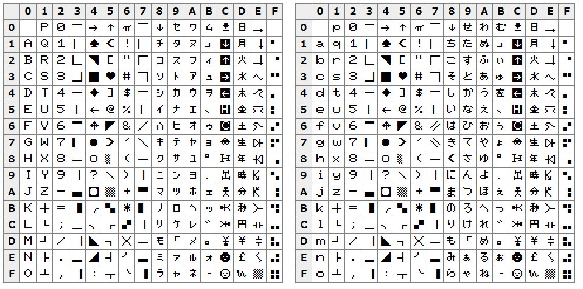

# MZ-700 フォントの TTF ファイル化の試み

## はじめに

紅茶羊羹 (@yokan) 氏の X での[ポスト](https://x.com/youkan700/status/1904172150308675973)
に触発され、MZ-700 フォントの TTF ファイル化を試みました。

## 使用例

- [sample.html](sample.html) の表示例
  - mz700.ttf をインストールした Windows 11
  - td 要素に mz700.ttf を指定
  - Google Chrome で表示
  - Firefox だと 0xc7 が 🛸, 0xef が 🐍 と表示される



## TTF ファイル化の流れ

- ディスプレイコードと Unicode コードポイントとの対応を JSON ファイル（map.json）で定義
- map.json、フォントファイル（FONT.ROM） から BDF ファイルを作成
- bdf2ttf で BDF ファイルから TTF ファイルを作成

### map.json

- キーはディスプレイコード（整数の文字列表現）。ATB=0 で 0 から255、ATB=1 は 256 から 511）
- 値は Unicode コードポイント（整数）
- TTF ファイル化に必須ですが機械的に作業することができず、
個々のグリフ（図形）を見ながら対応するコードポイントを決定することになります。
- 本リポジトリの map.json は、紅茶羊羹氏のサイトの
[MZ-700フォントのUnicode表現](http://www.maroon.dti.ne.jp/youkan/mz700/unicode.html)
ページをスクレイピングして作成したものです。

__定義例__

```json
{
  "0": 32,
  "1": 65,
  "2": 66,
  "3": 67,
  "4": 68,
  "5": 69,
  （以下省略）
}
```

### フォントデータ（FONT.ROM）

- MZ-700 エミュレータで使用するフォントデータファイル
- 実機の CGROM のデータと同じ（はず）
- 8 バイト/文字で ATB=0 と ATB=1 とを合わせて 512 文字、都合 8 * 512 = 4,096 バイトのデータファイル


### BDFファイル作成

map.json, FONT.ROM が用意できたら、次のスクリプトで BDF ファイルを作成します。

```
python build_bdf.py FONT.ROM map.json mz700.bdf
```

### TTF ファイル作成

BDF ファイルからアウトライン化した TTF ファイルを作成するには
Python パッケージ bdf2ttf を使用します。
このパッケージは FontForge に依存しているため、別途 FontForge のインストールも必要です。

準備ができたら次のように実行し、mz700.ttf を作成します。

```
bdf2ttf mz700.bdf -o mz700.ttf
```

## 備考

### BDF ファイルについて

- bdf2ttf がエラーにならない範囲での定義としているため、何らかの不都合が発生する可能性があります。

### FontForge の Python バイディングのインストールについて

- ubuntu 20.04 では次のようにインストールします。

```
sudo apt install fontforge
sudo apt install python3-fontforge
```

- ubuntu and/or Python のアップデートにより、グローバルインストールした Python には pip によるパッケージインストールができず venv の利用が必須になっているようです。
- python3-fontforge はグローバルインストールされますが venv 環境から参照できません。今回は PYTHONPATH をグローバルインストール先を指すようにして実行しています。ubuntu 20.04 では /usr/lib/python3/dist-packages/ でした
- FontForge はWindows へもインストールできますが Python は FontForge パッケージに ffpython.exe が含まれていて、これから FontForge を利用するようです。が、ffpython.exe から pip でのパッケ－ジインストールができませんでした。（各種設定を整えることでインストールできるかも知れませんが）

### 他の機種、他のサイズ(8x16等)への展開

- 8x8 ドットフォントの場合、新たに map.json を定義することで、build_bdf.py で BDF を作成可能だと思います。
- 8x16 等、他のサイズの場合は BDF の定義情報が変わるため build_bdf.py の修正が必要です。

### 本リポジトリの BDF ファイル、TTF ファイル

- 本リポジトリは mz700.bdf, mz700.ttf を含んでいますが、これは後述のフリーフォントから生成したものです。

## ライセンス


MIT（mz700.bdf, mz700.ttf を除く）

※ mz700.bdf, mz700.ttf は
[MZ700WIN関連ファイル再配布所](http://mzakd.cool.coocan.jp/mz-memories/mz700win.html) 
で配布されている mz700win に従います。

## 謝辞

TTF ファイル化にあたり、次の方々の情報を参考にさせていただきました。
有用な情報の公開に感謝します。

- 紅茶羊羹氏: マップ情報
  - [MZ-700フォントのUnicode表現](http://www.maroon.dti.ne.jp/youkan/mz700/unicode.html)
- AKD 氏：MZ-700/MZ-1500 用フリーフォント 
  - [MZ-700WIN,EmuZ-700/1500フォントデータの作成](http://mzakd.cool.coocan.jp/starthp/subpage15.html)
- mieki256's 氏：BDF 
  - [mieki256's diary: FontForgeでTTFにビットマップフォントを埋め込めた](http://blawat2015.no-ip.com/~mieki256/diary/20190530.html#201905300)